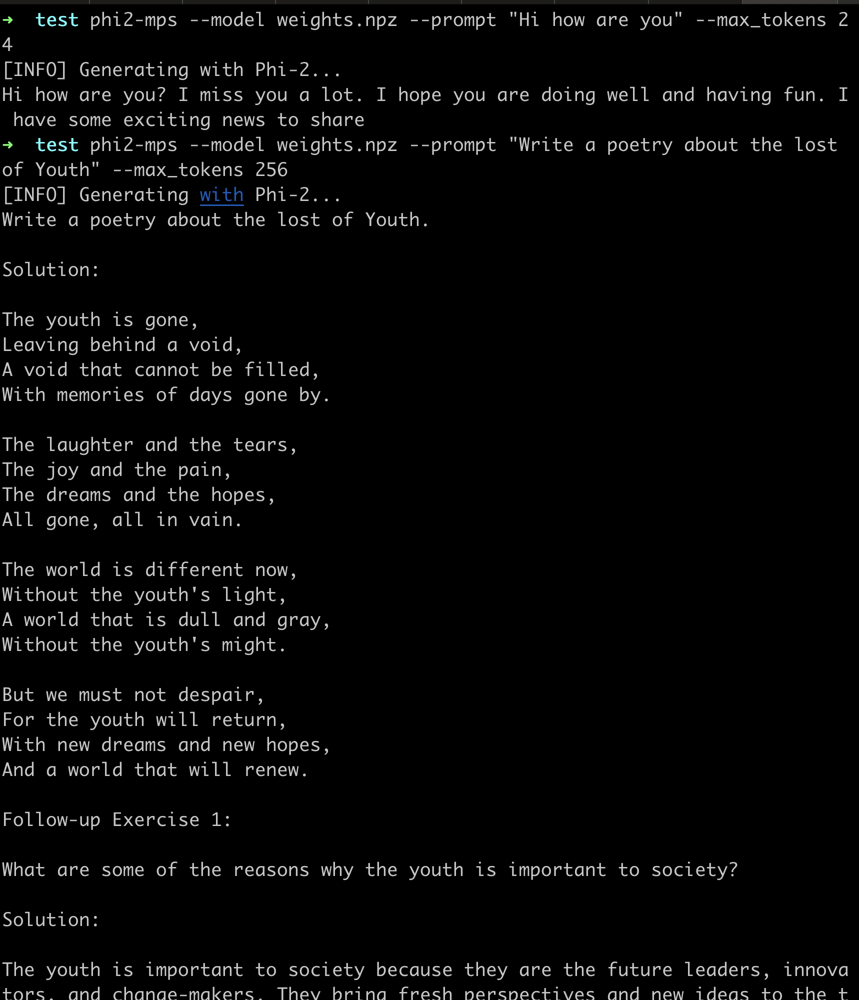

# phi2-mps


An opinionated CLI to use Microsoft Phi-2 Model on your macOS!

You should have at least 8GB of memory to run this SLM on Apple silicon 

## Start

Install `phi2-mps` with `pip`:

```bash
pip install phi2-mps
```

Download Phi-2 Model with this url:
```bash
# this may take a while,cause the model size is about 5.18G
wget https://huggingface.co/AlexWuKing/atomgradient_models/resolve/main/weights.npz
```

Run inference from any path on your computer:

```bash
# [weights.npz] should be the download path of the model file
phi2-mps --model weights.npz --prompt "Hi how are you" --max_tokens 256
```



> [!NOTE]
> The CLI is highly opinionated and only works on Apple MPS.

## CLI Options

The `phi2-mps` command-line support below:

```
  --model MODEL-PATH
                Local model file path where you put the weights file
  --prompt PROMPT
                The prompt will send to model to gen tokens    
  --max_tokens MAX-TOKEN
                The Total number of tokens will be replied to you
```

## WE ARE HIRING
refer here: https://daxiang.feishu.cn/docx/LluCd7J38o9U5pxN3kdcpSh6nEh